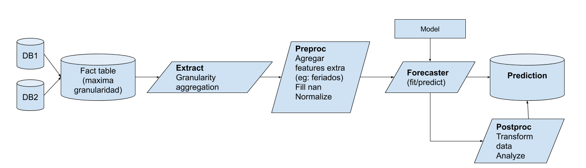
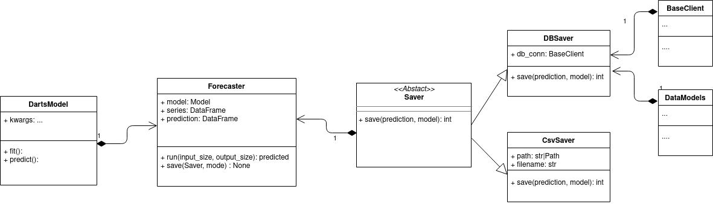

# SoaM

SoaM is library created by [Mutt](https://muttdata.ai/).
The main goal is to create a forecasting framework, this tool is developed with conjunctions of experience on previous projects.
There come the name: Son of a Mutt = SoaM


In this library we develop a data pipeline from any data source.
Extraction stage where yo can manage granularity and aggregation of your data.
Preprocessing stage where many preprocessing tool are available such as normalization or fill nan values and others.
Forecasting stage where a model fit and predict the results.
Lastly Postprocessing stage where you can modify the result based on business/real information or create analysis with the predicted values, such as an anomaly detection.

In this graphic we describe the SoaM pipeline.



## Overview of the Steps Run in SoaM (planned)

### Extraction
This stage extracts data from the needed sources to build the condensed dataset for the next steps. (This tends to be very project dependent.)

Then it converts the full dataset to the desired time granularity and aggregation level by some categorical attribute/s.

### Preprocessing
Here we implement functions to further cleanup and prepare the data for the following steps.

Such as:
* Add feature/transformation
* Fill nan values
* Apply value normalizations
* Shift values
* ...

### Forecasting
This stage receives the clean data, performs the forecast and store the predicted values where the user defines.
Currently we have implement result storage to CSV files and SQL databases.

We use [Darts](https://github.com/unit8co/darts) models to fit and predict data.
You can easily extend them to create custom ones.

Here is a class diagram from this stage


### Postprocessing
In this last stage or stages we can work on the forecasts we generated for example to:

* Clip/Cleanup the predictions
* Perform further analyses (such as anomaly detection)
* ...

## Examples

* Forecaster : here is a [notebook](./notebook/examples/forecaster.ipynb) using and explaining the forecaster stage.

## SoaM CLI
After installing SoaM locally (for example with `pip install soam`), you'll have some commands available:

* `soam init --output`, create a sample project which is ready to use SoaM. `cookiecutter` will then ask for most parameters via prompt (such as package and project name).

## Database management
For database storing we use some complementary tools:
* [muttlib.dbcon](https://gitlab.com/mutt_data/muttlib/) for database connections.

* [Decouple](https://github.com/henriquebastos/python-decouple) storing the database information in a separated file.
    We have a [`settings.ini`](soam/settings.ini) file to store the database credentials, when modifying it don't change the keys names

* [Alembic](https://alembic.sqlalchemy.org/en/latest/) for create the database migrations.
A brief description is below

* [SQLAlchemy](https://docs.sqlalchemy.org/en/) as an ORM, the schemas of the tables are defined in [data_models](soam/data_models.py)


### Alembic
This package uses alembic and expects you to use it!

Alembic is a database migration tool for usage with SQLAlchemy.
You define schemas with the SQLAlchemy and with Alembic you keep track of the database modifications such as add new columns, modify a schema or add new tables.

Here we setup alembic to use the credentials from the `settings.ini` file and get the defined models from `data_models`.
Be aware that alembic to run need this package installed!

When making any change of the data models you need them to impact into the database for this you will have to run:
```bash
alembic revision --autogenerate
alembic upgrade head
```

The first command will check the last version of the database and will [autogenerate](https://alembic.sqlalchemy.org/en/latest/autogenerate.html#what-does-autogenerate-detect-and-what-does-it-not-detect) the python file with the necessary changes.
It is always necessary to manually review and correct the candidate migrations that autogenerate produces.

The second command will use this file to impact the changes in the database.

For more alembic commands visit the [documentation](https://alembic.sqlalchemy.org/en/latest/)
