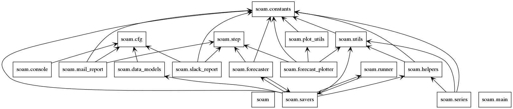
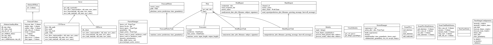
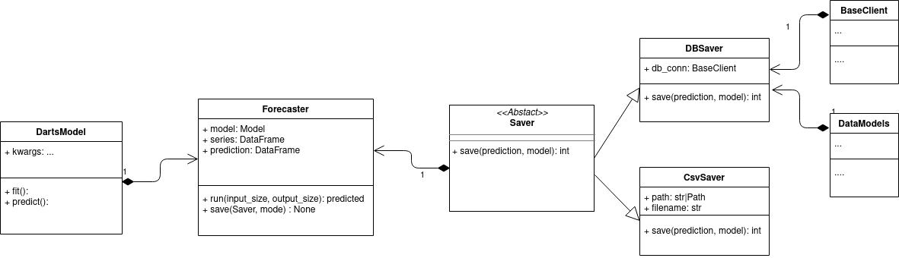

# Classes overview

SoamFlow and Step are analogous to prefects Flow and Task.
Step implements the run from the Prefect Tasks, and __repr__ to allow it
store it's different states.
Saver abstract class stores steps data, implements state handlers to save
Prefect Task and Flow states when they are updated.

##### Packages dependencies

##### Whole project class diagram

##### Forecasting class diagram

https://gitlab.com/mutt_data/onboarding/-/blob/master/docs/modern_python_apps.md#documentation

[//comment]: # (TODO: create some flow and class diagrams, some expected or possible architecture implementations.)
