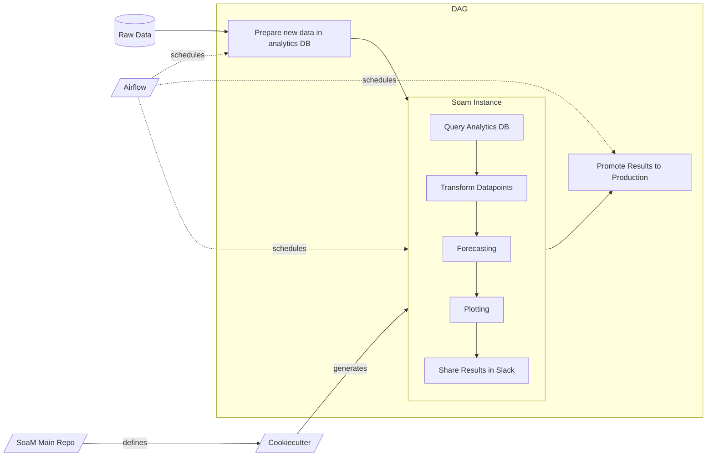

# End to End data product with SoaM:

The purpose of this document is to show how a generic end to end data product would look line using SoaM, [Cookiecutter](https://cookiecutter.readthedocs.io/en/) and [Airflow](http://airflow.apache.org/).

Let's imagine you need to run a process everyday that consists on loading the daily ABT, querying your database, transforming some datapoints, forecasting on a desired timeframe, plotting the results and sharing it by slack with your workteam. After that, promote results to the production environment. The diagram bellow show this process:



In this case, SoaM and Airflow will be interacting elbow to elbow to get this running. It's important to understand the distinctions between them.  
**SoaM will be you internal workflow manager, while Airflow will be your external manager**. Airflow will be in charge of scheduling all of your desired tasks through a DAG and retrying if an issue arises. Meanwhile SoaM, as your internal workflow manager, is the one in charge of managing our Python logic to carry out the desired steps mentioned before.

See the following sections where we double click on this so that it's clearer for you.


## Cookiecutter strucutre

[Cookiecutter](https://medium.com/worldsensing-techblog/project-templates-and-cookiecutter-6d8f99a06374) is a CLI tool (Command Line Interface) to create an application boilerplate from a template. It uses a templating system — [Jinja](https://jinja.palletsprojects.com/) — to replace or customize folder and file names, as well as file content.

We use Cookiecutter to save time constructing a new repository, to avoid forgetting mandatory files like Readme or Changelog; and to lower the entry level to new collaborators — new team members, freelancers, partners.

After installing SoaM locally, you can run the following command:

```bash
$ soam init --output
```

To generate a project structure ready to use SoaM based on Cookiecutter. After executing that command, cookiecutter will ask you for parameters via prompt.

## Airflow

We use **Apache Airflow** to create the DAG that schedules the following pipeline:
1. Extract the needed data from your the raw data DB and load it into your chosen database.
1. Next, schedule the execution the SoaM built pipeline.
1. Promote the results of the Soam run to production.

The key here is that Airflow takes care of scheduling on a defined basis (hourly, daily, weekly...), retries, dependencies among other tasks while the Soam pipeline is only concerned with providing funcionalities specific to the project.

## SoaM Components at the core of the project's logic

Once you have your data stored in your database, its time for SoaM to come into the scene.

1. Firstly, `TimeSeriesExtractor` will come into action by querying the data needed from your database and returning a ready to work Pandas `DataFrame`.

2. Then, after you have your `DataFrame`, it's time for the `Transformer`. With the toolkit provided by this module you will be able to apply any SciKit-Learn transformation or even create a custom one for your specific use case.

3. Thirdly, and once the data is fully cleaned, `Forecaster` offers you the ability to apply different Machine Learning algortihms on your data such as [FBProphet](https://facebook.github.io/prophet/) or [Orbit](https://github.com/uber/orbit) or again a custom one authered by the user to forecast your time-series on a desired time-frame.

4. Last but not least, it's time to plot and see the results! Here is when the `ForecastPlotter` appears and generates a beautiful plot where you will see your past data and the forecast produced in the previous step.

5. Finally, the `Reporting` module provides tools to generate and share reports with your team or friends via Google Sheets, Email, PDF and/or Slack.

To see how some of this can be easily implemented, check our [quickstart](notebook/examples/quickstart.ipynb)!
