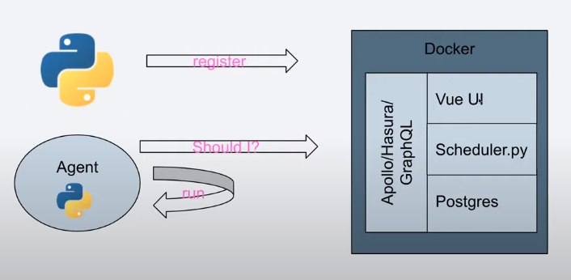

# Prefect overview

In this document will show the overview of [Prefect](https://docs.Prefect.io/core/).

Prefect is an open-source Python framework, it have two main services. 
Prefect Core, a workflow management and Prefect Cloud(recently open-sourced) for data orchestrator.

## Overview
* Don't have project template. 
* Task objects can be instanced with decorators or class inheritance
* Configurations are in a `TOML` file .
* It have a good CLI and a good API, the documentation is good.
* The developers are ex Airflow developers so it has many common things.

## Install
for installation use conda:
```bash
conda install -c conda-forge prefect
```
also can be installed with pip:
```bash
pip install prefect
```
and install [dependencies]() for example:
```bash
pip install "prefect[aws, redis]"
```
They also provide a [Docker image](https://hub.docker.com/r/prefecthq/prefect).

```bash
prefect version
```
    0.13.3

While whe write this overview Prefect is on version 0.9.2

## Project Template 
Prefect doesn't provide a project template like `cookiecutter` or other.

Prefect contains a CLI done with click. Quite complete.

## Context
This module implements the [Prefect context](https://docs.prefect.io/api/latest/utilities/context.html#context) that is available when tasks run.

Tasks can import prefect.context and access attributes that will be overwritten when the task is run.

For instance when logging: 
```python
logger = prefect.context.get("logger")
logger.debug("logging debug")
```
## Pipeline abstraction
Prefect is based on a Flow and Task objects to run. 
Tasks objects can be instanced with decorators or class inheritance. 
Flows are context-manager objects.

Here is a simple Prefect Flow.

```python
from prefect import Flow, task

@task
def hello_world():
    return "Hello"

@task
def salutation(greeting):
    print(f"{greeting} Prefect!")

with Flow("my_pipeline") as f:
    h = hello_world()
    salutation(h)

f.run()
```
    Hello Prefect!

Dependencies between Tasks in Prefect are defined by the parameters or you can define it `Airflow-like`: `task.set_dependencies(self, task_1)`

or with and `Edge`, Edges represent connections between Tasks.

You can inherit a Task definition to an other class.

## Executors
Executors are responsible for executing steps within a flow run.

There are several defined Executors:
* `Dask`
* `Local`
* `LocalDask`

The Dask executor its meant to run Dask cluster, and LocalDask can achieve multithreading locally.

## Run versioning 
Versioning is tied to the prefect cloud, because it use the database that you create

## Debugging
For debugging there are no many tools.
The suggested tool is `raise_on_exception()` function and can be used like this:

```python
with raise_on_exception():
    f.run() 
```

## Configuration
Prefect's settings are stored in a configuration file called `config.toml`.
You create a user configuration file for permanent settings.

Prefect configuration key can be set by environment variable, as Airflow, 
`PREFECT__TASKS__DEFAULTS__MAX_RETRIES=4`.

The user configuration file only needs to contain values you want to change.
In there you can create a switching logic files:

```INI
environment = "prod"
user = "${environments.${environment}.user}"

[environments]

    [environments.dev]
        user = "test"

    [environments.prod]
        user = "admin"
```
or create one config file for each environment. 

You must define where is your user config:
`PREFECT__USER_CONFIG_PATH == <PATH>`

## Parameters 
Parameters are special tasks that can receive user inputs whenever a flow is run.
```python
from prefect import task, Flow, Parameter

@task
def print_plus_one(x):
    print(x + 1)

with Flow('Parameterized Flow') as flow:
    x = Parameter('x', default = 2)
    print_plus_one(x=x)

flow.run(parameters=dict(x=1)) # prints 2
flow.run(parameters=dict(x=100)) # prints 101
flow.run() #prints 3
```

## States and Signals
State is the main currency in the Prefect platform.
It is used to represent the current status of a flow or task.

Every run is initialized with the `Pending` state, meaning that it is waiting for execution.
During execution a run will enter a `Running` state.
Finally, runs become `Finished`. 

Signals are Exceptions, when raised, are used to signal state changes when tasks or flows are running.
These are used in TaskRunners and FlowRunners as a way of communicating the changes in states.

## Storing/caching results and flow
Prefect provides a few ways to work with cached data between tasks or flows.
In-memory caching of task inputs is automatically applied by the Prefect pipeline.
Users can also configure to cache the output of a prior run of a task and use it as the output of a future run of that task or even as the output of a run of a different task.

Prefect Core allow to store the results of a task or a complete flow. 
```python
from prefect import task, Flow
from prefect.engine.results import LocalResult


@task(result=LocalResult(dir="/Users/prefect/results"))
def root_task():
    return [1, 2, 3]

@task(result=LocalResult(location="{date:%A}/{task_name}.prefect"))
def downstream_task(x):
    return [i * 10 for i in x]

with Flow("local-results") as flow:
    downstream_task(root_task)
```
This way you can persist the output of the tasks. 

You can also store a flow with [Prefect Storage](https://docs.prefect.io/api/latest/environments/storage.html)
is an interface that encapsulates logic for storing, serializing and even running Flows.

## UI
Prefect UI is based on the prefect Cloud service, this service set up with a docker-compose file different services to make more stable and can be hosted on an other server. 


And the UI would look


## Extras
* Mapping: flexible map/reduce model for dynamically executing parallel tasks.
* [TaskLibrary](https://docs.prefect.io/core/task_library/): `prefect.tasks` contains many integration with other tools like DBT, Docker, Great Expectations, Slack and many more.
* Schedules: schedules objects can be attached to Flows via the `schedule` keyword argument.
* Cloud: AWS(Lambda, S3 and Step), GCS (GCS and BigQuery), Azure (Blob, CosmosDB, Dataset)