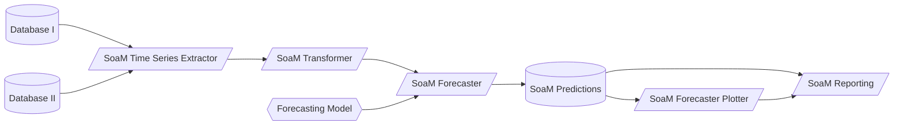

# End to End data product with SoaM:

## Cookiecutter strucutre

Cookiecutter is a CLI tool (Command Line Interface) to create an application boilerplate from a template. It uses a templating system — Jinja2 — to replace or customize folder and file names, as well as file content.

We use Cookiecutter to save time constructing a new repository, to avoid forgetting mandatory files like Readme or Changelog; and to lower the entry level to new collaborators — new team members, freelancers, partners.

See further info about cookiecutter [here](https://medium.com/worldsensing-techblog/project-templates-and-cookiecutter-6d8f99a06374).

## Airflow

Use **Apache Airflow** to create DAGs that fullfil the following:
 - If needed, extract the needed data from your desired API and load it into your chosen database on a defined basis (hourly, daily, weekly...).
 - Next, schedule the following SoaM tasks with an airflow scheduler on your desired basis (hourly, daily, weekly...).

## SoaM Components at the core of the project's Logic.

Once you have your data stored in your database, its time for SoaM to come into the scene.

1. Firstly, SoaM Time Series Extractor will come into action by querying the data needed from your database and returning a ready to work pandas DataFrame.

2. Then, after you have your DataFrame loaded, it's time for the SoaM Transformer. With the toolkit provided by this module you will be able to apply any SciKit-Learn transformation or even create a custom one for your specific use case.

3. Thirdly, and once the data is fully cleaned, SoaM Forecaster comes into play to offer you the ability to apply different Machine Learning algortihms on your data such as: [FBProphet](https://facebook.github.io/prophet/), [Orbit](https://github.com/uber/orbit) or even [Exponential Smoother](https://www.statsmodels.org/stable/generated/statsmodels.tsa.holtwinters.ExponentialSmoothing.html#statsmodels.tsa.holtwinters.ExponentialSmoothing) to forecast your time-series on a desired time-frame.

4. Last but not least, it's time to plot and see the results! Here is when the SoaM Forecast Plotter appears and generates a beautiful plot where you will see your past data and the forecasted one.

5. Finally, SoaM Reporting provides tools to generate and share reports with your team or friends via Google Sheets, Email, PDF and/or Slack.

To see how some of this can be easily implemented, check our [quickstart](notebook/examples/quickstart.ipynb)!
