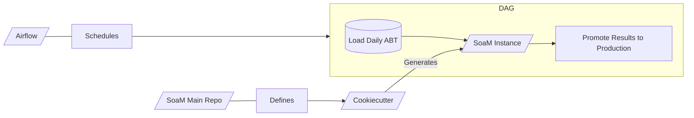

# End to End data product with SoaM:

The purpose of this document is to show how a generic end to end data product using SoaM, Cookiecutter and Airflow will look like.

Take this example, imagine you need to run a process everyday that consists on loading the daily ABT, querying your database, transforming some datapoints, forecasting on a desired timeframe, plotting the results and sharing it by slack with your workteam. After that, promote results to the production environment. See the diagram below.

In this case, SoaM and Airflow will be interacting elbow to elbow to solve this implications. It's important to understand the distinctions between them. **SoaM will be you internal workflow manager, while Airflow will be your external manager**. Airflow will be in charge of scheduling all of your desired tasks through a DAG and retrying if an issue arises. Meanwhile SoaM, as your internal workflow manager, is the one in charge of generating all of your workflow desired steps, being these: querying the data, transforming it, forecasting, plotting and reporting.

See the following sections where we double click on this so that it's clearer for you.

## Cookiecutter strucutre

Cookiecutter is a CLI tool (Command Line Interface) to create an application boilerplate from a template. It uses a templating system — Jinja2 — to replace or customize folder and file names, as well as file content.

We use Cookiecutter to save time constructing a new repository, to avoid forgetting mandatory files like Readme or Changelog; and to lower the entry level to new collaborators — new team members, freelancers, partners.

After installing SoaM locally, you can run the following command:

    soam init --output

To generate a project structure ready to use SoaM based on Cookiecutter. After executing that command, cookiecutter will ask you for parameters via prompt.

See further info about cookiecutter [here](https://medium.com/worldsensing-techblog/project-templates-and-cookiecutter-6d8f99a06374).

## Airflow

Use **Apache Airflow** to create DAGs that fullfil the following:
 - If needed, extract the needed data from your desired API and load it into your chosen database on a defined basis (hourly, daily, weekly...).
 - Next, schedule the following SoaM tasks with an airflow scheduler on your desired basis (hourly, daily, weekly...) and with your chosen retry scheme.

## SoaM Components at the core of the project's Logic.

Once you have your data stored in your database, its time for SoaM to come into the scene.

1. Firstly, SoaM Time Series Extractor will come into action by querying the data needed from your database and returning a ready to work pandas DataFrame.

2. Then, after you have your DataFrame loaded, it's time for the SoaM Transformer. With the toolkit provided by this module you will be able to apply any SciKit-Learn transformation or even create a custom one for your specific use case.

3. Thirdly, and once the data is fully cleaned, SoaM Forecaster comes into play to offer you the ability to apply different Machine Learning algortihms on your data such as: [FBProphet](https://facebook.github.io/prophet/), [Orbit](https://github.com/uber/orbit) or even [Exponential Smoother](https://www.statsmodels.org/stable/generated/statsmodels.tsa.holtwinters.ExponentialSmoothing.html#statsmodels.tsa.holtwinters.ExponentialSmoothing) to forecast your time-series on a desired time-frame.

4. Last but not least, it's time to plot and see the results! Here is when the SoaM Forecast Plotter appears and generates a beautiful plot where you will see your past data and the forecasted one.

5. Finally, SoaM Reporting provides tools to generate and share reports with your team or friends via Google Sheets, Email, PDF and/or Slack.

To see how some of this can be easily implemented, check our [quickstart](notebook/examples/quickstart.ipynb)!
